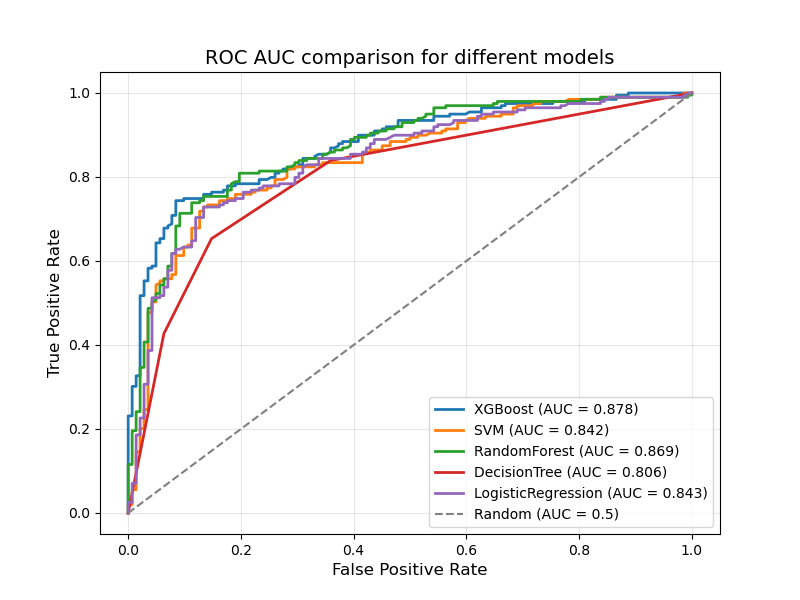
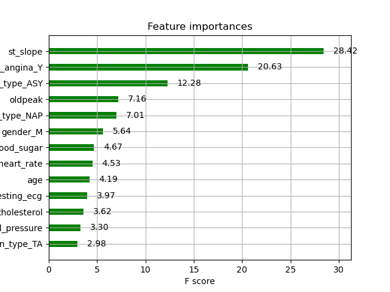

# Heart disease prediction 

This project develops a machine learning model to predict heart disease risk using health and lifestyle data, enabling early intervention. By merging two datasets, performing exploratory data analysis (EDA) and addressing class imbalance with SMOTE, the project achieves high predictive performance with XGBoost. Predictive tools are crucial for identifying individuals at higher risk of developing heart disease. This allows early intervention or prevention.  

--- 

## 📊 Features

- Data Preprocessing: Merged two datasets with features like blood indicators, health metrics, and lifestyle habits.

- Class Imbalance Handling: Applied SMOTE to balance the dataset for unbiased model performance.

- Multiple ML Models: Evaluated Logistic Regression, Decision Tree, Random Forest, XGBoost and SVM for binary classification.

- Hyperparameter Tuning: Optimized models using Optuna to maximize ROC_AUC and F1-score.

- Feature Importance Analysis: Identified key predictors of heart disease to enhance model interpretability.

---

## ⚙️ Technologies

Python: Core programming language.

Pandas, NumPy: Data manipulation and analysis.

Matplotlib, Seaborn: Data visualization.

Scikit-learn: Machine learning models and preprocessing.

SMOTE: Synthetic minority oversampling.

Optuna: Hyperparameter optimization.

XGBoost: High-performance gradient boosting model.

---

## 📈 Results

 

1. XGBoost achieved the highest performance with a ROC_AUC of 0.88 and accuracy of 0.80, outperforming other models.

2. Key features (e.g. cholesterol levels, age) were identified as top predictors through feature importance analysis.

3. Visualizations and EDA revealed patterns in health metrics, supporting data-driven insights.

